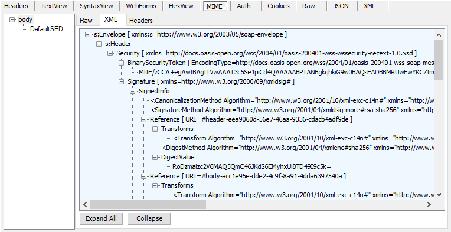

# MIME Inspector for Fiddler
A [Fiddler](http://www.telerik.com/fiddler) inspector to easily inspect MIME messages (and any protocol using MIME over HTTP such as AS4). 

# Features
- Inspect MIME messages from inside Fiddler
- Show MIME parts as Raw or XML
- Inspect MIME headers for each part
- Save individual parts to disk

# Installation
1. Extract the zip to `%USERPROFILE%\Documents\Fiddler2\Inspectors` (Create folders as necessary)
2. Restart Fiddler

# License
This work is licensed under the MIT License.